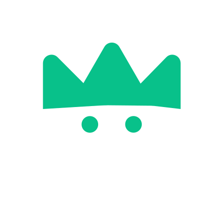
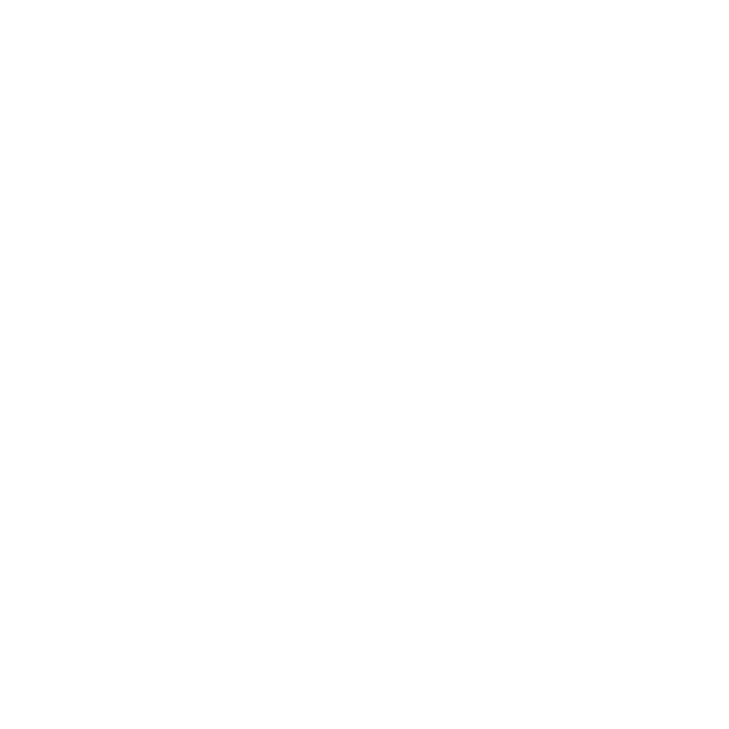
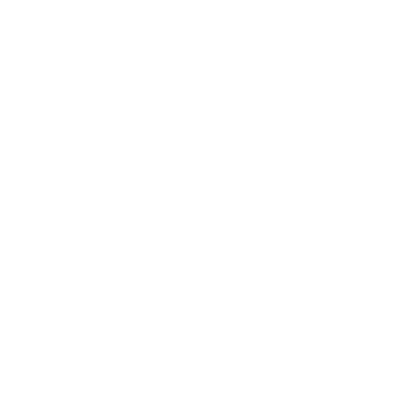
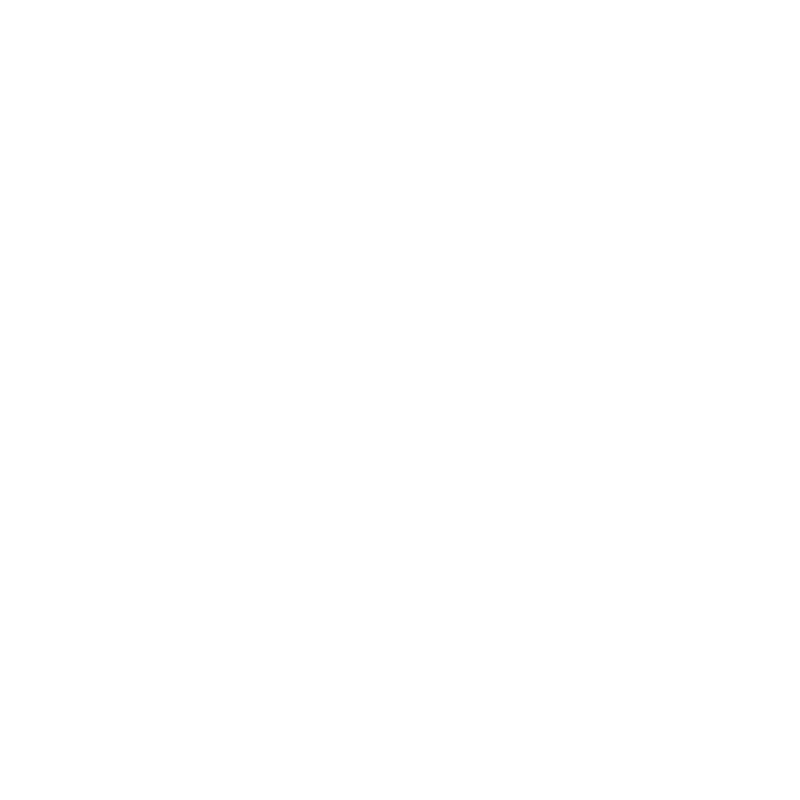
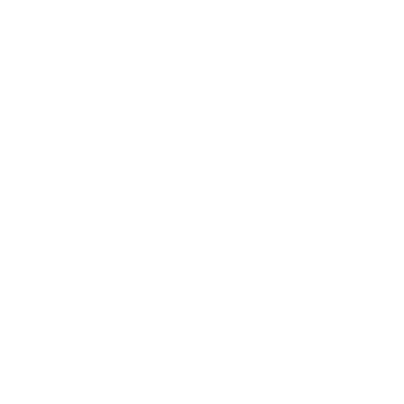
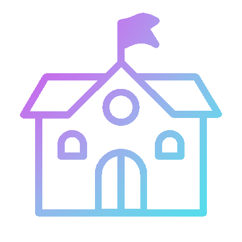
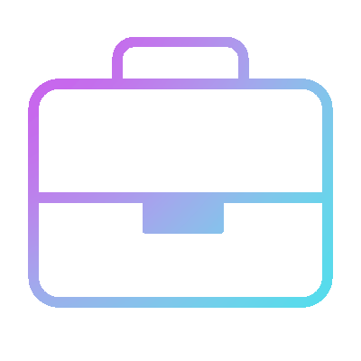
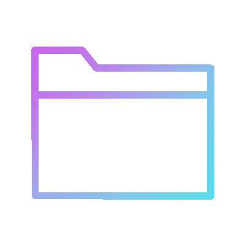
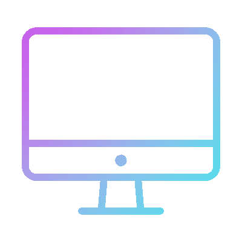
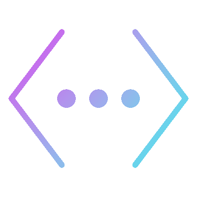

    
    <h1>Bryan's Portfolio Site [WIP]</h1>
    
     
     
    

        
        
        
    

    

        
        
        
        
        
        
        
    

 

# React + Vite

This template provides a minimal setup to get React working in Vite with HMR and some ESLint rules.

Currently, two official plugins are available:

- [@vitejs/plugin-react](https://github.com/vitejs/vite-plugin-react/blob/main/packages/plugin-react/README.md) uses [Babel](https://babeljs.io/) for Fast Refresh
- [@vitejs/plugin-react-swc](https://github.com/vitejs/vite-plugin-react-swc) uses [SWC](https://swc.rs/) for Fast Refresh

## Image Assets Used

    
    &nbsp; &nbsp; &nbsp; &nbsp; &nbsp; &nbsp; 
    
    &nbsp; &nbsp; &nbsp; &nbsp; &nbsp; &nbsp;
    

    

    Image assets used in this project were primarily sourced from: 
    <a href="https://www.svgrepo.com/">SVG Repo</a>,
    <a href="https://lordicon.com/">Lordicon</a>, and
    <a href="https://lottiefiles.com/">LottieFiles</a>.

    Sources of three logos above:
    <a href="https://www.svgrepo.com/logo.svg">SVG Repo Logo</a>,
    <a href="https://lordicon.com/assets/svg/main/lordicon-mobile.svg">Lordicon Logo</a>,
    <a href="https://drive.google.com/drive/folders/1i1cbnzIR02sMWpUh2xGKyESfazt4_4T8">LottieFiles Logo</a>, and
    <a href="https://lottiefiles.com/brand-assets">LottieFiles Brand Assets Page</a>.

| Name | Image |  Source | Link to Source Ver. | File Name | Alterations to Base Ver. |
| :----: | :----: | :---------: | :------------: | :--------------------------: | :----------------------------: |
| Dragon SVG |  |  | <a href="https://www.svgrepo.com/svg/317411/dragon">Link Here</a> | dragon-svgrepo-com.svg | None |
| Menu SVG|  |  | <a href="https://www.svgrepo.com/svg/532195/menu">Link Here</a> | menu-svgrepo-com.svg | Changed Color to White |
| House SVG |  |  | <a href="https://www.svgrepo.com/svg/511018/house-01">Link Here</a> | house-01-svgrepo-com.svg | Changed Color to White |
| Person SVG |  |  | <a href="https://www.svgrepo.com/svg/447734/person-male">Link Here</a> | person-male-svgrepo-com.svg | Changed Color to White |
| Briefcase SVG|  |  | <a href="https://www.svgrepo.com/svg/533408/briefcase-alt">Link Here</a> | briefcase-alt-svgrepo-com.svg | Changed Color to White |
| Contacts SVG |  |  | <a href="https://www.svgrepo.com/svg/491800/email-contact-ui-web">Link Here</a> | email-contact-ui-web-svgrepo-com.svg | Changed Color to White |
| IT Developer Lottie |  |  | <a href="https://lordicon.com/icons/wired/gradient/680-it-developer">Link Here</a> | wired-gradient-680-it-developer.json | None |
| School Lottie |  |  | <a href="https://lordicon.com/icons/wired/gradient/486-school">Link Here</a> | wired-gradient-486-school.json | None |
| Suitcase Lottie |  |  | <a href="https://lordicon.com/icons/wired/gradient/187-suitcase">Link Here</a> | wired-gradient-187-suitcase.json | None |
| Folder Lottie |  |  | <a href="https://lordicon.com/icons/wired/gradient/120-folder">Link Here</a> | wired-gradient-120-folder.json | None |
| Computer Monitor Lottie |  |  | <a href="https://lordicon.com/icons/wired/gradient/478-computer-display">Link Here</a> | wired-gradient-478-computer-display.json | None |
| Coding Lottie |  |  | <a href="https://lordicon.com/icons/wired/gradient/742-code">Link Here</a> | wired-gradient-742-multimedia-code-1.json | None |
| Envelope Lottie |  |  | <a href="https://lordicon.com/icons/wired/gradient/177-envelope-send">Link Here</a> | wired-gradient-177-envelope-send.json | None |
| Conversation Lottie |  |  | <a href="https://lordicon.com/icons/wired/gradient/981-consultation">Link Here</a> | wired-gradient-981-consultation.json | None |
| Astronaut Lottie Animation | |  | <a href="https://lottiefiles.com/animations/cute-astronaut-operating-laptop-rxBJyz07Vw"> Similar Image 1 </a> <a href="https://lottiefiles.com/animations/astronaut-on-laptop-fOzMUFQcka"> Similar Image 2 </a> | Animation-1697251945018.json | |
| Blue-Purple Loading Disc Lottie Animation | |  | <a href="https://lottiefiles.com/animations/loading-disc-ua9XQSY0gR"> Link Here</a> | Animation-1704913159226.json | |
